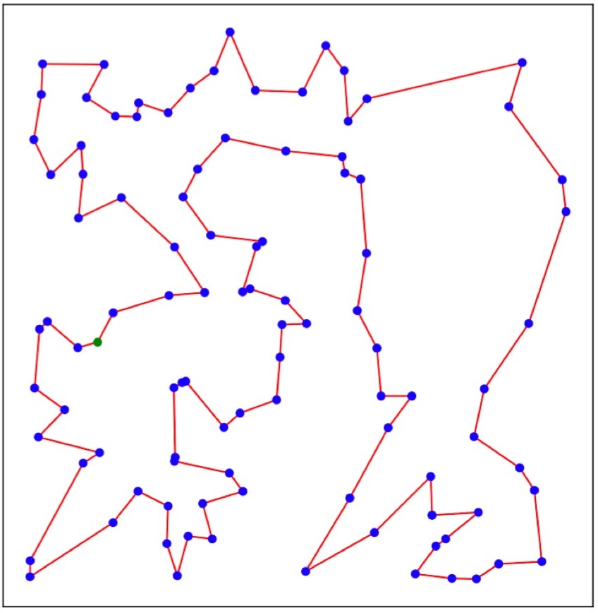

# TSP Transformer
May, 2024
 
 

 

### Description
The Transformer Network for the Traveling Salesman Problem 
 

# GitHub repo
git clone: https://github.com/MaiStar28/DoAn_TSP # clone repo
 

### Results
1. Network Training (with RTX 2080 Ti 11GB)  
TSP50 (1 GPU) : Run notebook 'train_tsp_transformer_TSP50.ipynb' 
TSP100 (2 GPUs) : Run notebook 'train_tsp_transformer_TSP100.ipynb' 
2. Network Testing  
TSP50 : Run notebook 'test_tsp_transformer_beamsearch_TSP50.ipynb'. Optimality gap: -0.004%. 
TSP100 : Run notebook 'test_tsp_transformer_beamsearch_TSP100.ipynb'. Optimality gap: 0.371%. 
3. Visualization  
TSP50 : Run notebook 'visualization_TSP50.ipynb' 
TSP100 : Run notebook 'visualization_TSP100.ipynb' 
 

